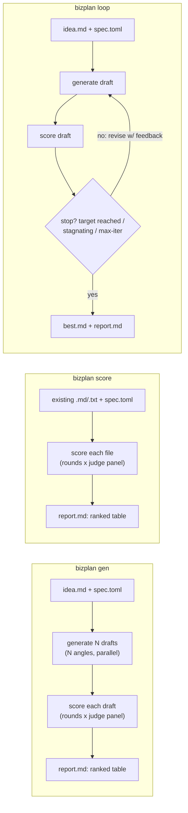
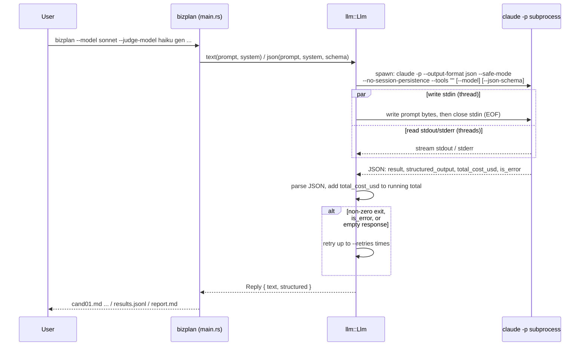
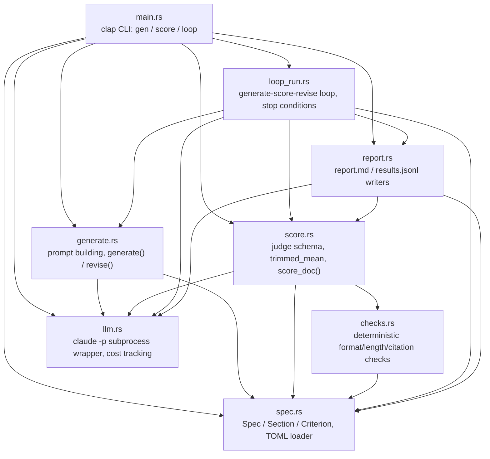
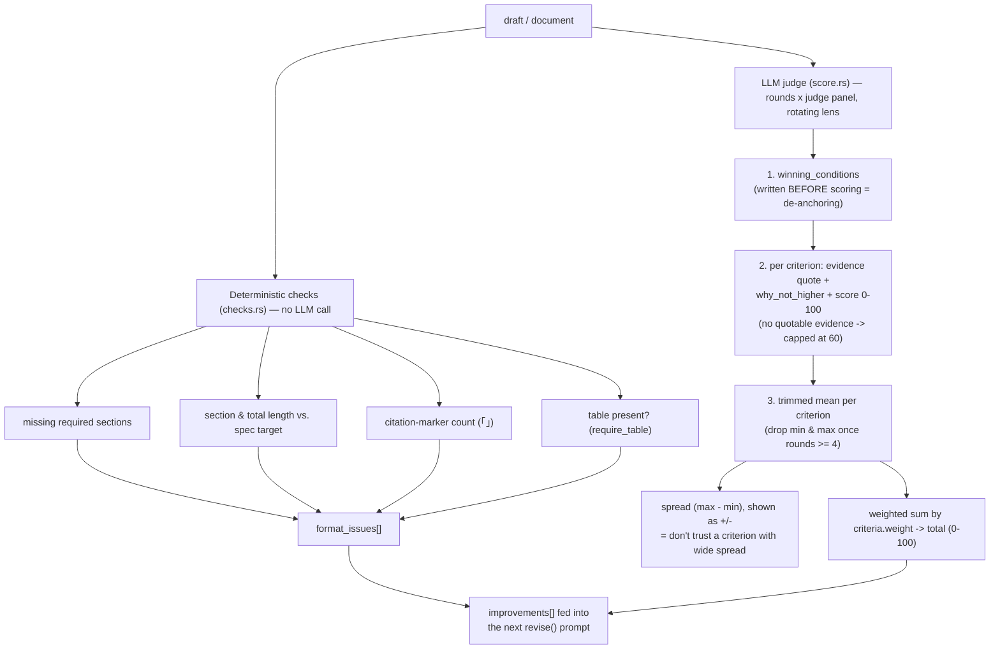
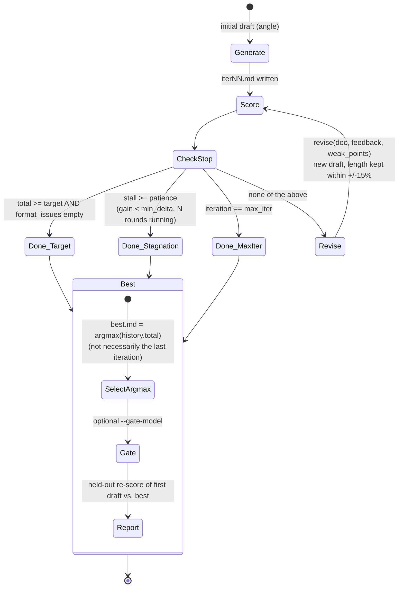
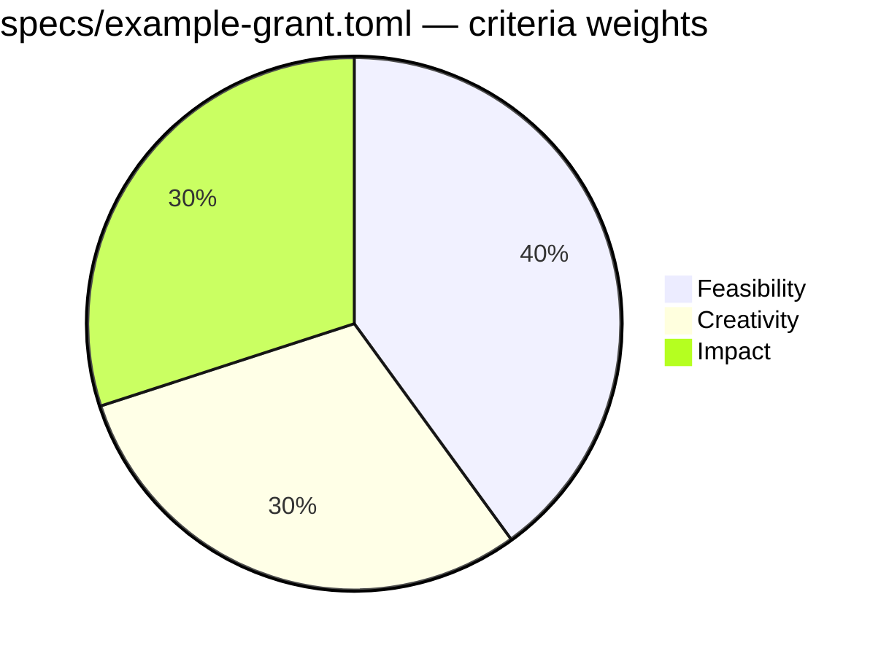

# bizplan-loop

A Rust CLI that generates multiple business-plan drafts, scores them against a
weighted rubric using an LLM judge panel, and iteratively regenerates them
using the judge's feedback. The LLM backend is the Claude Code CLI (`claude -p`)
run as a subprocess — no separate API key required, no network client of its own.

> Step-by-step usage, workflows, troubleshooting: **[USAGE.md](USAGE.md)**
> Design rationale, with citations to the literature behind every choice: **[DESIGN.md](DESIGN.md)**

## Requirements

- Rust 1.70+
- `claude` CLI installed and logged in (if it's not on `PATH`, pass `--claude-bin /path/to/claude`)

## Build

```bash
cargo build --release   # binary at target/release/bizplan
```

## What it does

`bizplan` has three subcommands built around the same generate → score loop:



- **`gen`** — generate N drafts from different framing angles, score all of
  them, rank them. Use this to find which framing wins under a given rubric.
- **`score`** — score an existing document (or a directory of them) without
  generating anything.
- **`loop`** — generate, score, revise using the judge's feedback, repeat
  until a target score is hit or improvement stalls. Every iteration's
  document is kept; the report is a trend table plus an optional held-out
  re-check.

## Usage

```bash
# 1) explore framings — cheap, broad
bizplan --model sonnet --judge-model haiku \
  gen --spec specs/example-grant.toml --idea idea.md \
  -n 6 --rounds 2 --concurrency 3 --out runs/grant

# 2) score an already-written document
bizplan --judge-model sonnet,haiku \
  score --spec specs/example-grant.toml --input my-application.md --rounds 3 --out runs/check

# 3) self-improvement loop to a target score, with a held-out gate
bizplan --model opus --judge-model sonnet --gate-model haiku \
  loop --spec specs/example-grant.toml --idea idea.md \
  --target 85 --max-iter 4 --rounds 2 --out runs/loop
```

`gen` writes `cand01.md … candNN.md`, `results.jsonl` (raw per-criterion
scores, spread, format checks, improvement notes), and `report.md` (ranked
table + per-document detail). `loop` writes `iter01.md … iterNN.md` (every
iteration is kept), `best.md` (the highest-scoring iteration — not
necessarily the last one), and `report.md` (iteration trend + warnings +
held-out check if `--gate-model` was given).

## How it talks to `claude`

Every call shells out to the Claude Code CLI in the same shape (verified
against `claude --help`):

```
claude -p --output-format json --safe-mode --no-session-persistence --tools "" \
       [--model M] [--append-system-prompt S] [--json-schema SCHEMA] [--max-budget-usd X]
```

| Flag | Reason |
|---|---|
| `--safe-mode` | Skips loading the working directory's `CLAUDE.md` / skills / plugins / hooks / MCP → reproducible runs. Disabled by `--load-context`. |
| `--tools ""` | Disables all built-in tools (Read/Edit/Write/Bash) → pure text generation, no file access. Measured effect: a single `haiku` call went from 2–4 min to ~20s once tool access was cut. |
| `--no-session-persistence` | No session file is written, avoiding contention when calls run in parallel. |
| `--json-schema` | Forces the scoring response into a schema. The CLI validates it and returns the object in `structured_output` (more reliable than prompting for JSON and string-parsing the reply). |
| `--output-format json` | Lets the caller read `result` / `structured_output` / `total_cost_usd`. Cumulative spend is printed at the end of each run. |

`--bare` is deliberately not used: it skips OAuth/keychain and only accepts
`ANTHROPIC_API_KEY`, which breaks auth for subscription-login users.

The prompt is sent over stdin (avoids argv length limits; the CLI caps stdin
at 10MB). Writing stdin and reading stdout/stderr happen on separate threads
concurrently, to avoid a deadlock from pipe-buffer saturation. Each call is
bounded by `--timeout-secs` (default 600s) and retried up to `--retries`
times (default 2).



## Architecture



One line per module:

- **`main.rs`** — clap CLI (`Cli`/`Cmd`), builds the generation `Llm` and the
  judge panel (`--judge-model a,b,c` rotates round to round), dispatches to
  `gen` / `score` / `loop`, runs a bounded thread-per-chunk parallel map
  (`par_map`, driven by `--concurrency`).
- **`llm.rs`** — the only place that shells out to `claude`. Owns retries,
  timeout, JSON parsing, and the process-wide cumulative cost counter
  (`total_cost_usd`).
- **`spec.rs`** — `Spec` / `Section` / `Criterion`, loaded from a `specs/*.toml`
  file; renders the sections and rubric into prompt text.
- **`generate.rs`** — builds the initial generation prompt and the
  feedback-revision prompt; `angles_for()` fills in default framing angles
  when a spec doesn't define its own.
- **`checks.rs`** — deterministic, LLM-free checks: missing required
  sections, section/total character-count bounds, citation-marker (`「」`)
  count, table presence.
- **`score.rs`** — builds the judge prompt/schema, calls the judge panel for
  `--rounds` rounds (rotating model and lens), aggregates with a trimmed
  mean, computes the weighted total.
- **`loop_run.rs`** — the generate → score → revise loop: stop conditions,
  argmax-over-history selection for `best.md`, length-inflation and
  non-monotonic-best warnings.
- **`report.rs`** — renders `report.md` (ranked table + per-document detail)
  for `gen`/`score`, and the iteration-trend + held-out-gate report for `loop`.

## Scoring pipeline



Judge design points, each grounded in a cited failure mode (full detail in
[DESIGN.md](DESIGN.md)):

1. **0–100, not 0–10.** A coarser scale collapses distinct verdicts into ties.
2. **Trimmed mean, not median.** A 0–10 integer median produces too many ties
   to detect small improvements; outliers (min & max) are dropped once a
   criterion has 4+ rounds.
3. **Verbatim evidence + "why not higher," mandatory.** Judge output is a
   JSON schema requiring a document quote per criterion; missing evidence
   caps the score at 60.
4. **De-anchoring.** `winning_conditions` is the first field in the schema,
   so the judge states what a winner looks like before it has scored
   anything — because the schema is filled in generation order.
5. **Judge panel over repeat rounds.** `--judge-model a,b,c` rotates models
   round to round (and 6 fixed lenses rotate alongside), rather than asking
   one model the same thing N times.
6. **Held-out gate (`--gate-model`, `loop` only).** A model that never
   participated in the loop re-scores only the first and best drafts after
   the fact. If the loop score rose but the held-out score didn't move
   nearly as much, the report flags it as judge-optimization rather than
   real improvement.
7. **Score isn't passed back into revision prompts** — only the improvement
   list and comments are, to avoid giving the generator a number to game.

## Self-improvement loop (`loop`)



Stop condition is whichever of these fires first:

1. score ≥ `--target` **and** zero deterministic format issues,
2. improvement below `--min-delta` (default 2.0) for `--patience` (default 2)
   consecutive iterations,
3. `--max-iter` (default 4) reached.

Two warnings the report can print:

- **Length canary** — if document length grew >25% while the score gained
  <5 points, it flags likely verbosity-gaming rather than real improvement.
- **Non-monotonic best** — if the last iteration isn't the highest-scoring
  one, it says so explicitly (the returned/kept document is the argmax over
  history, not the final iteration — self-correction isn't assumed to be
  monotonic).

## Spec format (`specs/*.toml`)

A spec defines the document's sections, the weighted rubric, and generation
angles. Fields (from `spec.rs`):

| Field | Type | Meaning |
|---|---|---|
| `name` | string | Form/competition name |
| `context` | string | Host/judging context — inserted directly into every prompt |
| `scoring_source` | string | Where the weights came from (announcement text); shown in the report |
| `total_chars` | usize | Target total length; 0 = unchecked |
| `min_citations` | usize | Minimum `「source」`-style citation markers; 0 = unchecked |
| `require_table` | bool | Require at least one markdown table |
| `angles` | [string] | Framing angles cycled across `gen`'s N drafts |
| `bands` | [string] | Score-band descriptors (0–100); falls back to a built-in 5-band default |
| `[[sections]]` | id, title, guide, chars, required | Must match a `## <title>` heading in the document (whitespace-insensitive partial match) |
| `[[criteria]]` | id, name, weight, guide | Rubric line item; weights are normalized internally, so they don't need to sum to 100 |

The repo ships one concrete example, `specs/example-grant.toml` — a Korean
government-grant rubric with 2 sections, 2 framing angles, and 3 weighted
criteria:



To add a new competition, copy that file and transcribe the real
announcement's judging criteria and weights — don't invent scoring weights
that weren't published; if the announcement doesn't disclose them, say so in
`scoring_source` and weight the criteria evenly.

## Idea input (`idea.md`)

Draft quality tracks this file closely. `USAGE.md` recommends covering:

```markdown
# Service name / one-line definition
# Problem: who is stuck, in what situation, why (stats + sources if you have them)
# Solution: flow (input → processing → output)
# Tech stack / what's actually implemented / what isn't
# Revenue model, cost structure (real figures only)
# Differentiation vs. competitors
# Team, timeline
```

The repo's own `idea.example.md` is intentionally minimal — a single line:

```
Solomon: multi-agent AI decision-support service. Targets solo entrepreneurs.
Tauri v2 desktop app, local SQLite, weighted voting, risk gate.
```

Don't fill gaps with numbers you don't have — the generation system prompt
instructs the model to mark unverified figures as "estimated" and to cite
sources for factual claims, but an empty `idea.md` field still gets
penalized in scoring rather than papered over with invention.

## CLI reference

Global (apply to all subcommands):

| Flag | Default | Meaning |
|---|---|---|
| `--claude-bin` | `claude` | Path to the `claude` executable |
| `--model` | claude's default | Generation model (`opus`/`sonnet`/`haiku`/`fable` or a full model ID) |
| `--judge-model` | same as `--model` | Judge model(s). Comma-separated → rotates round to round (recommended) |
| `--retries` | 2 | Retries per LLM call on failure |
| `--timeout-secs` | 600 | Per-call timeout |
| `--max-budget-usd` | none | Per-call cost cap, passed to `claude --max-budget-usd` |
| `--load-context` | off | Load the working directory's `CLAUDE.md`/plugins/hooks (skips `--safe-mode`) |
| `--verbose` | off | Print retry/failure logs |

`gen`:

| Flag | Default | Meaning |
|---|---|---|
| `--spec` | required | Path to `specs/*.toml` |
| `--idea` | required | Path to the idea source file |
| `-n`, `--count` | 3 | Number of drafts to generate |
| `--out` | `runs` | Output directory |
| `--rounds` (alias `--judges`) | 2 | Scoring passes per document |
| `--concurrency` | 1 | Parallel generation/scoring |
| `--no-score` | off | Generate only, skip scoring |

`score`:

| Flag | Default | Meaning |
|---|---|---|
| `--spec` | required | Path to `specs/*.toml` |
| `--input` | required | File, or directory of `*.md`/`*.txt` (skips `report.md`) |
| `--out` | `runs` | Output directory |
| `--rounds` (alias `--judges`) | 2 | Scoring passes per document |
| `--concurrency` | 1 | Parallel scoring |

`loop`:

| Flag | Default | Meaning |
|---|---|---|
| `--spec` | required | Path to `specs/*.toml` |
| `--idea` | required | Path to the idea source file |
| `--out` | `runs` | Output directory |
| `--target` | 85.0 | Early-stop score threshold |
| `--max-iter` | 4 | Maximum iterations |
| `--rounds` (alias `--judges`) | 2 | Scoring passes per iteration |
| `--min-delta` | 2.0 | Improvement below this counts toward stagnation |
| `--patience` | 2 | Consecutive stagnant iterations before stopping |
| `--angle` | spec's first angle | Framing angle for the initial draft |
| `--gate-model` | none | Held-out model that re-scores first vs. best after the loop ends |

## Reading the report

- **Total** = per-criterion trimmed mean (0–100) × the criterion's weight.
- **(±N)** next to a criterion = spread across judging rounds. Above ±10,
  don't trust that criterion's verdict.
- **Format issues** are checked by Rust, not the LLM (missing sections,
  length over/under target, citation count, table presence) — these are
  submission-rule violations, so fix them before worrying about the score.
- **Improvements** is the actually actionable output — read it before the
  score itself.
- In a `loop` report, the **held-out** table is the important one: if the
  loop's score gain and the held-out gain diverge sharply, that improvement
  is probably not real.
- None of this is an absolute grade — only a **relative** comparison within
  the same spec and the same judge model(s).

## Limitations / assumptions

- LLM scores are not real judging scores — useful for relative comparison
  and improvement direction within one spec and one judge setup, not as an
  absolute grade.
- If the generation model and judge model are the same, it rates its own
  writing style favorably (a warning prints when `--judge-model` isn't set).
- Repeating one model N times still has correlated error, so effective
  sample size is much smaller than N — prefer `--judge-model a,b` over
  raising `--rounds`.
- `claude -p` doesn't expose temperature, so draft diversity comes entirely
  from the angle prompts.
- Output is markdown only; hwpx/PDF conversion is out of scope.

## License

Apache-2.0
